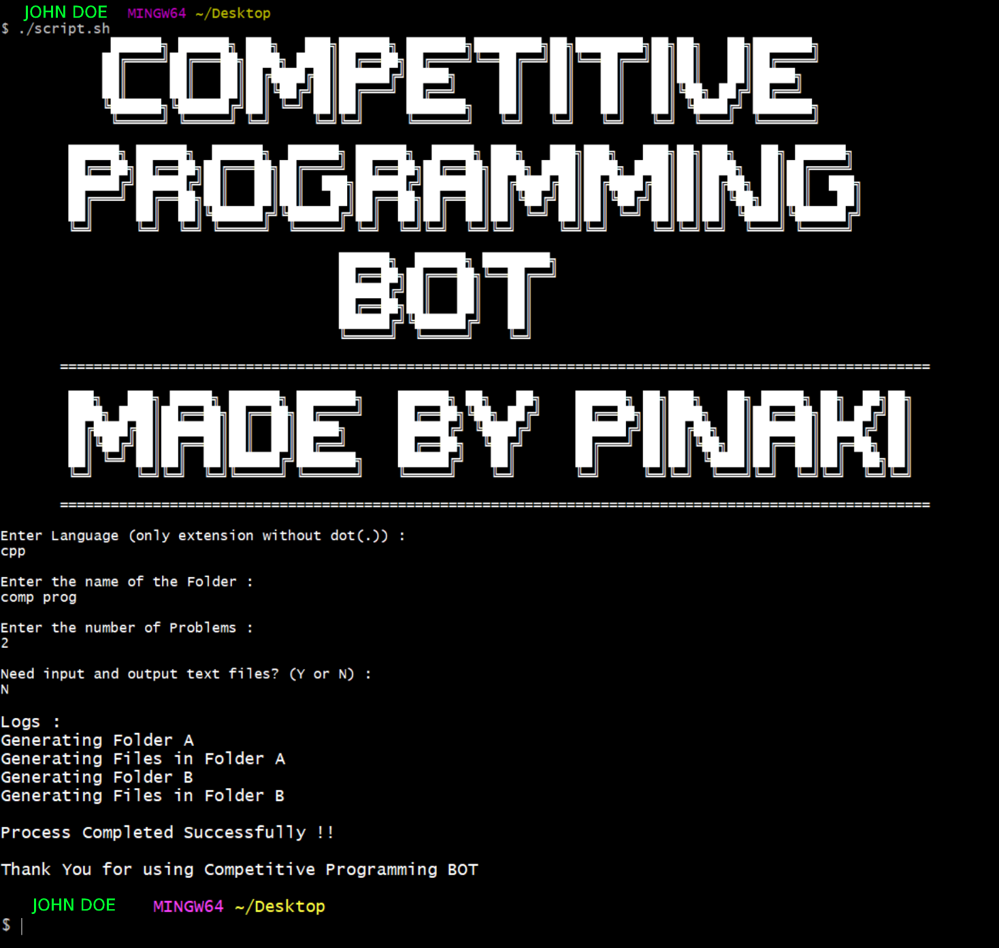
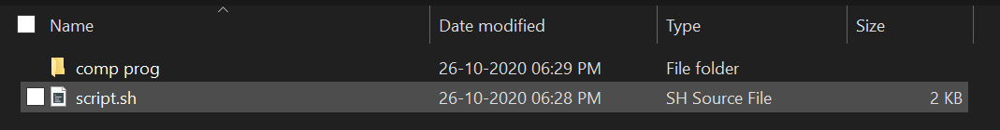
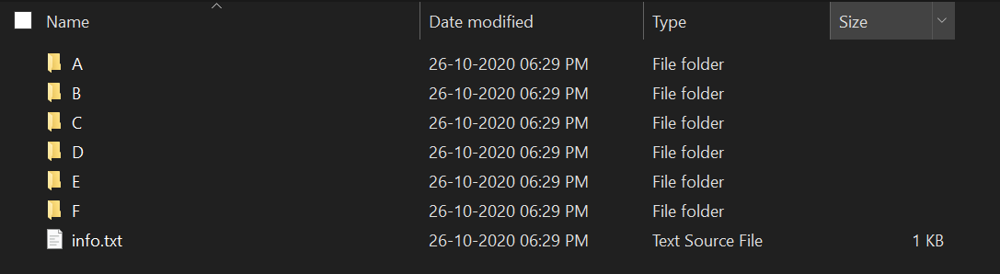
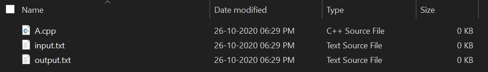

# Competitive-Programming-Bot


**Competitive Programming Bot** is a script that enables competitive programmers to create a neat and clean folder structures for better organisation of code. It can come in handy for *any programming language* and for coders *Noob* to *Pro*.

## Screenshots
### Script Running

### File and Folder Structures







## Installation
- Fork the repository ( [Here is the Guide](https://help.github.com/articles/fork-a-repo/) ).
- Clone to your machine
- Copy the "script .sh" to the location where the folder structure is to be created.
- Then follow the below given instructions : 

## Code to run:
Open bash terminal and run the following command : 
```
./script.sh
```

## Contributions

Contributions are always **welcome and recommended**! Here is how:

- Fork the repository ( [Here is the Guide](https://help.github.com/articles/fork-a-repo/) ).
- Clone to your machine
- Create a new branch
- Make your changes
- Create a pull request


## Will be Decommissioned soon